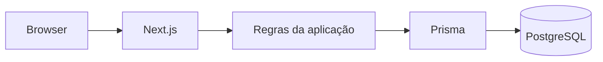
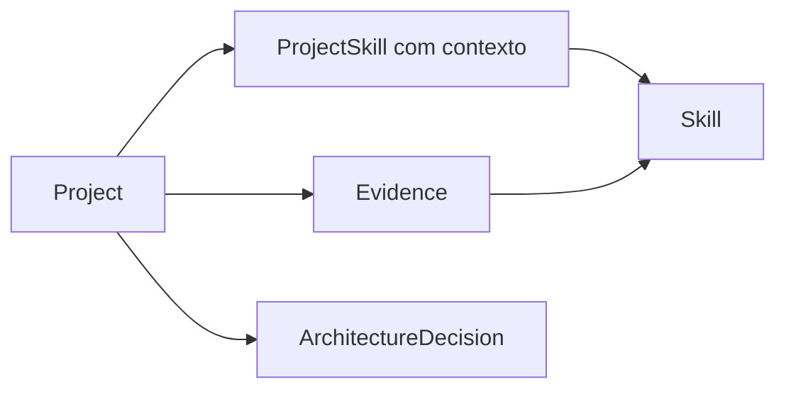

# Arquitetura

## Estilo

Monólito modular usando Next.js como aplicação full stack.

## Motivo

O produto ainda está na fase inicial. Separar frontend e API em serviços distintos adicionaria
complexidade operacional sem uma necessidade comprovada.

## Componentes

## Módulos principais

## Estado atual

- Next.js concentra interface, rotas e operações do produto;
- Server Components são o padrão para telas;
- Client Components devem ser usados apenas quando houver interação no cliente;
- Server Actions devem concentrar operações de escrita;
- Route Handler expõe `/api/health`;
- Prisma acessa o PostgreSQL;
- Zod valida entradas nos limites da aplicação;
- Docker Compose fornece ambiente local;
- GitHub é fonte de código e evidências verificáveis;
- Vitest cobre testes automatizados do projeto;
- showcase público expõe evidências sem dados privados.

## Modelo de domínio

- Project;
- Skill;
- ProjectSkill com contexto de aplicação;
- Evidence;
- ArchitectureDecision.

## Planejado

- ampliar cobertura de testes E2E com Playwright.

## Diretrizes

- preservar o monólito modular enquanto ele resolver o problema;
- manter regras da aplicação próximas dos casos de uso reais;
- validar entrada com Zod;
- persistir dados via Prisma;
- usar PostgreSQL como banco relacional;
- manter Docker Compose como caminho principal de desenvolvimento local;
- extrair API separada apenas quando existir justificativa técnica.
