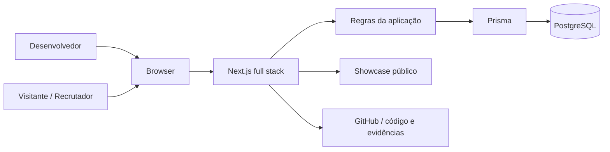
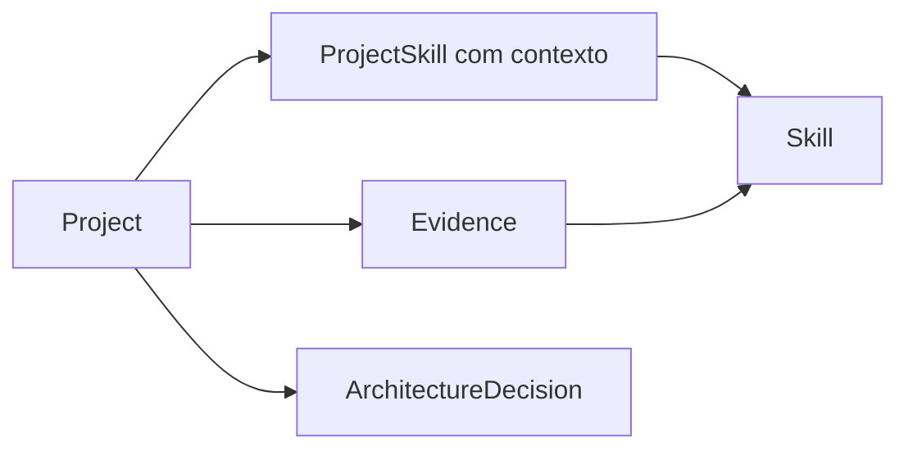

# Diagrama de Contexto

```mermaid
flowchart LR
    Browser[Browser] --> Next[Next.js full stack]
    Next --> Rules[Regras da aplicação]
    Rules --> Prisma[Prisma]
    Prisma --> PostgreSQL[(PostgreSQL)]

    Developer[Desenvolvedor] --> Browser
    Visitor[Visitante / Recrutador] --> Browser
    Next --> Showcase[Showcase público]
    Next --> GitHub[GitHub / código e evidências]
```

O GitHub aparece inicialmente como fonte de links/evidências, não como integração automática.

```mermaid
flowchart LR
    Project[Project] --> ProjectSkill[ProjectSkill com contexto]
    ProjectSkill --> Skill[Skill]
    Project --> Evidence[Evidence]
    Evidence --> Skill
    Project --> ArchitectureDecision[ArchitectureDecision]
```

O fluxo central do produto é: **Projeto -> Skill -> Contexto -> Evidência**.
