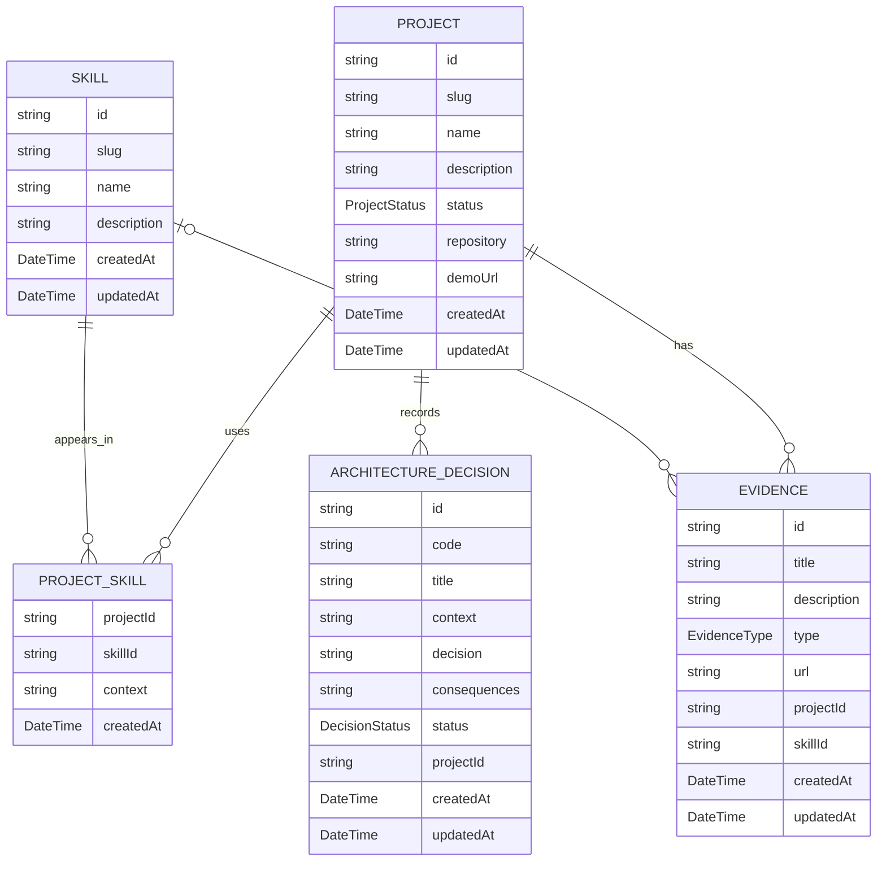

# Modelo de Dados

O modelo organiza o fluxo **Projeto -> Skill -> Contexto -> Evidência**.

## Relações

1. `Project` 1:N `ProjectSkill`.
2. `Skill` 1:N `ProjectSkill`.
3. `Project` 1:N `Evidence`.
4. `Skill` 1:N `Evidence`, quando a evidência estiver associada a uma skill.
5. `Project` 1:N `ArchitectureDecision`.

`ProjectSkill` usa chave composta: `(projectId, skillId)`.

`prisma/schema.prisma` é a fonte executável do modelo.
